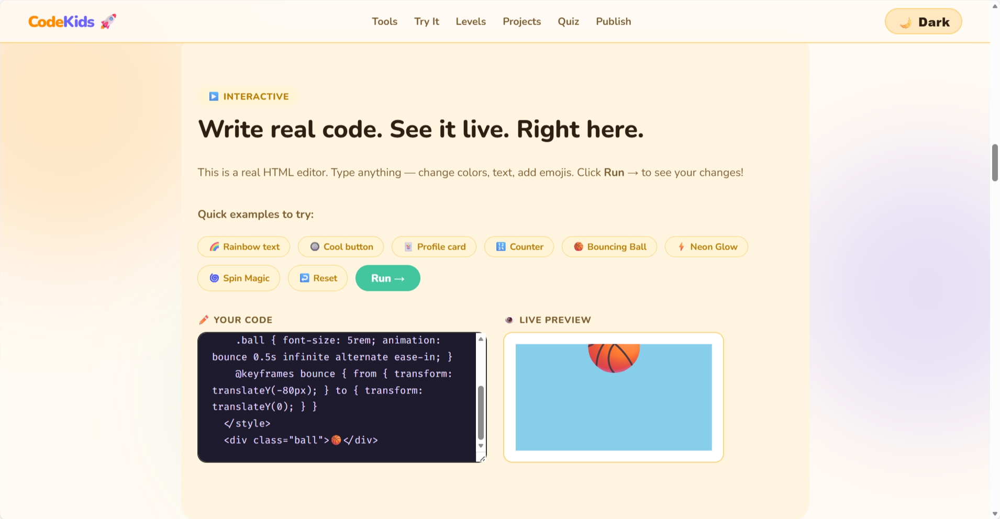

# KatCodes For Kids 👩‍💻🧒


> A simple educational website designed to introduce kids to basic coding concepts in a fun and beginner-friendly way.

🌐 **Live Site:**  
https://chineme-eng.github.io/KatCodes-For-Kids/

---

## 📸 Preview



---

## 📚 About

**KatCodes For Kids** is a simple educational project built to help children and beginners understand what coding is and how websites work.

The goal is to make programming feel **fun, approachable, and creative** while demonstrating how basic web technologies can be used to build real websites.

---

## ✨ Features

- Beginner-friendly explanations of coding concepts  
- Simple and clean design for easy learning  
- Interactive elements using JavaScript  
- Lightweight static website  
- Hosted for free using GitHub Pages  

---

## 🛠 Built With

- **HTML** – website structure  
- **CSS** – styling and layout  
- **JavaScript** – interactive features  
- **GitHub Pages** – deployment and hosting  

---

## 📂 Project Structure

KatCodes-For-Kids/
│
├── index.html
├── style.css
├── script.js
├── assets/
│ └── screenshot.png
└── README.md


---

## 🚀 Running the Project Locally

Clone the repository:

```bash
git clone https://github.com/chineme-eng/KatCodes-For-Kids.git
cd KatCodes-For-Kids

Then open index.html in your browser.

🎯 Purpose

This project was created to demonstrate how simple web technologies like HTML, CSS, and JavaScript can be used to build beginner-friendly educational tools for kids learning about coding.

🤝 Contributing

Contributions are welcome.

You can help by:

Improving the design

Adding kid-friendly coding examples

Fixing bugs

Adding new interactive features

Fork the repository

Create a new branch

Make your changes

Submit a pull request

📄 License

This project is open-source and available under the MIT License.
